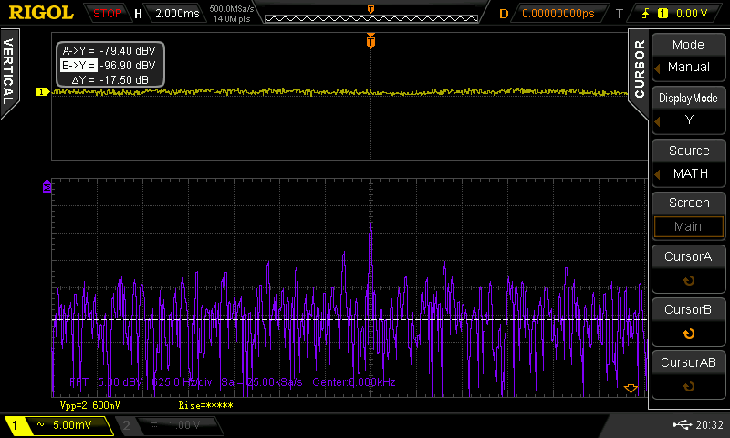

A simple resistive divider network to dampen the output of an audio amplifier 16db.

## The problem

See that spike at 6KHz? It was always there no matter what volume my Logitech Z-5500 Digital was set to. Very annoying.

The solution was this attenuator circuit that was fitted to each of the 5 channels of the amplifier. That peak at 6KHz is now 16db less annoying. Problem solved.

## Front

## Back

With instructions on how to tune the final resistor values.

## 1/2 3d printable enclosure

Print 2, they fit together. There are slots in which the pcb's fit.

## The result

With 2 years of collected dust, but hey, it works :-)

